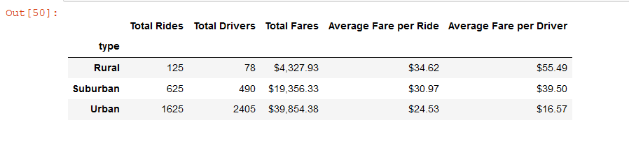
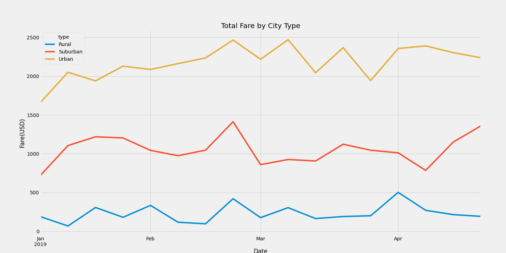

# PyBer_Analysis
### Analysis Overview
  The purpose of this analysis was to assist V.Isualize and Omar with their company at PyBer using Pandas and Matplotlib to aquire ride-sharing data. In the intial analysis 2 CSV file were merged and manipulated to gather data on various aspects of ride-sharing service across different types of cities. Using Matplotlib I was able to effieciently gather and visualize data to further present to V.Isualize and to PyBer. However for further analysis I was tasked with making a multiple-line graph based on weekly fares for each data type.
  
### Results
  The data upon analysis suggests the total rides, total fares and total drivers are proportional to their respective city types; rural has the least all around, suburban having more than rural in every category but less than urban with the most numbers in every category. Seeminly as a result of those numbers average fare prices per ride and driver are much higher in rural cities, lower in suburban cities and lowest in urban cities. This could be in part of the lower number of drivers and demand for rural cities and the higher driver count in suburban and urban cities.
 ###### Fares across city types

#### Results cont.
  The second analysis done across total fare by city type within the given dates of 1/1/2019-4/29/2019. In this charted analysis we can see that rural still earns the least in fares with suburban in the middle and urban being the highest earner. The data suggests that in the last week of February there was a surge in fare totals across every city type and a prompt drop off by the first week of March. Outside of that aforementioned rise and fall around March there wasn't any uniformity present in the rest of the data. Urban Cities had the most drastic rises and falls in this given time period.
###### Total fare by city type  

### Summary
  Based on the results, three recommendations that can be suggested to the CEO of pyber are as follows:
  1. One may be able to provide a richer analysis with more years of data provided to spread across city types to see if the intial anaylsis of 2019 hold true to other years.
  2. The data could be refactored to show frequency of rides across total fares for each city type to see in which city type do drivers have a higher earnings.
  3. The total fare by city type could be expanded upon to show different years within the same dates to better prepare for future rides in the same dates; having fewer drivers active in the projected slow periods and higher more in the projected surge periods.
